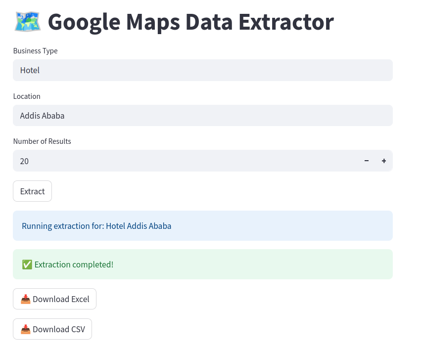

# 🗺️ Google Map Data Scraping

This project allows users to scrape business details such as name, address, phone number, websites, ratings, and total reviews directly from Google Maps using a simple Streamlit interface. It is especially useful for collecting business leads or contact information based on specific keywords and locations.

---

## 📌 Features

- ✅ Search by **keyword** and **location**
- ✅ Extract business details (name, phone, address, website)
- ✅ Export data as **CSV** or **Excel**
- ✅ Simple and interactive **Streamlit** dashboard
- ✅ Designed to bypass manual scraping from Google Maps

---

## 🚀 Demo

Run the app and search for businesses like:

> Example: `Pharmacy` in `Addis Ababa`

 <!-- Optional: Add a screenshot image here -->

---

## 🧰 Technologies Used

- [Python 3.x](https://www.python.org/)
- [Streamlit](https://streamlit.io/)
- [Selenium](https://selenium.dev/)
- [Pandas](https://pandas.pydata.org/)
- [ChromeDriver](https://sites.google.com/chromium.org/driver/) for web automation

---

## 📦 Installation

### 1. Clone the Repository

```bash
git clone https://github.com/your-username/google-map-data-scraping.git
cd google-map-data-scraping
